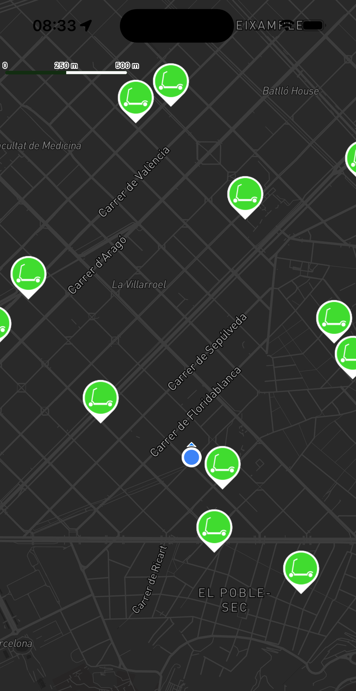
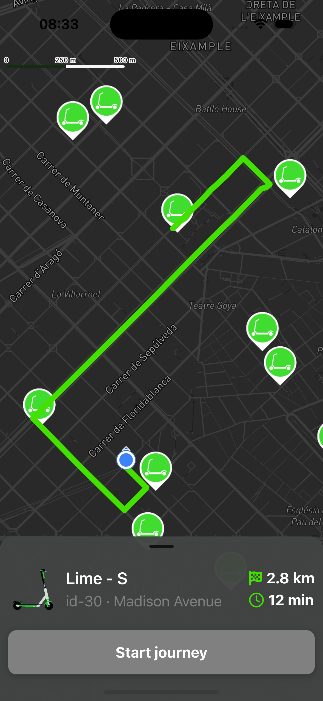

# Lime Clone App README

## Overview

This repository contains the source code for a Lime Clone App built using React Native and Expo. The app simulates a scooter rental service, featuring a map displaying scooters near the user's location, directions to selected scooters, and a bottom sheet providing details such as distance, time, and location. The main packages utilized are React Native Mapbox, React Native Reanimated, React Native Gesture Handler, Expo Location, and Gorhom Bottom Sheet.

   
    Mapbox Directions: Provides navigation routes to the selected scooter.
    Bottom Sheet: Shows details about distance, estimated time, and location information.
    Scooters Nearby: Displays scooters close to the user's current location.

## Features

- ** React Native Mapbox Integration: Displays a map view with scooters and user location.
- ** Bottom Sheet: Shows details about distance, estimated time, and location information.
- ** Mapbox Directions: Provides navigation routes to the selected scooter.
- ** Scooters Nearby: Displays scooters close to the user's current location.

### Screenshots

<div style="display: flex; flex-direction: 'row';">


</div>

## Configuration

- SUPABASE_URL=your_supabase_url
- SUPABASE_ANON_KEY=your_supabase_anon_key

## Dependencies:

- React Native Reanimated: For animations and smooth interactions.
- React Native Gesture Handler: For handling touch gestures.
- Expo Location: For accessing device location.
- Gorhom Bottom Sheet: For the bottom sheet component.
- React Native Mapbox: For Mapbox integration.


## Installation

Before you begin, ensure you have met the following requirements:

1. Node.js installed on your machine.
2. Expo CLI installed globally (npm install -g expo-cli).
3. Mapbox account and access token.
4. Clone the repository:

```bash
git clone https://github.com/abazudosen/ProfitFinance ```

5. cd limeClone
6. npm install

7. Set up environment variables:
    a. Create a .env file in the root of your project.
    b. Add your Mapbox access token to the .env file:
    
    ```bash
    MAPBOX_ACCESS_TOKEN=your_mapbox_access_token
    ```

8. Configure Mapbox:
   a. Ensure you have react-native-mapbox-gl/maps installed:
    
    ```bash
    npm install @react-native-mapbox-gl/maps
    ```
   b. Link the Mapbox SDK:

   ```bash
    npx pod-install ios
   ```

   c. Update App.js to configure Mapbox with your access token:
   
   ```bash
   import MapboxGL from '@react-native-mapbox-gl/maps';

   // Set the Mapbox access token from environment variables
   MapboxGL.setAccessToken(process.env.MAPBOX_ACCESS_TOKEN);

   const App = () => {
     // Your app code here
   };

   export default App;
   ```

7. npx expo run 'ios' or 'android'


## Usage

1. Launch the app:
     Scan the QR code generated by Expo with your mobile device or run on an emulator.

2. Explore the Map:
     The map displays your current location and nearby scooters.

3. Get Directions:
     Select a scooter to view the route and navigation instructions.

4. View Details:
     Pull up the bottom sheet to see details about the selected scooter, including distance and estimated time.